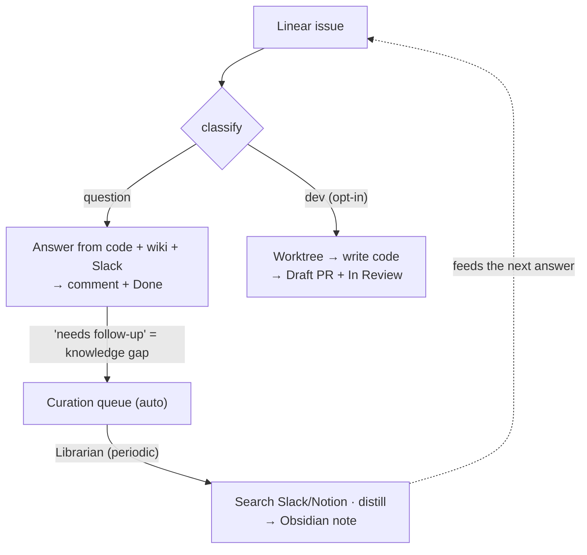

# symphony-librarian

A read-only **codebase Q&A bot** driven by a Linear board, paired with a **knowledge curator** that distills scattered decisions (Slack/Notion) into an Obsidian vault — so answers get smarter over time.

- **Symphony** — watches your issue tracker, picks up question issues, and answers them grounded in your **codebase + wiki + linked Slack threads**. Read-only by default (no PRs): it posts the answer as a comment and moves the issue to Done. Reply on the issue and it answers your follow-up too (the full thread is fed back as context). Adapted from [openai/symphony](https://github.com/openai/symphony).
- **Dev mode** (opt-in) — tickets labeled `dev`/`feature`/`bug` (or judged so) are *implemented*: Symphony works in an isolated git worktree, writes the code, and opens a **Draft PR** for you to review (commit/PR formatted, AI attribution stripped), moving the ticket to In Review. Off by default.
- **Librarian** — harvests the "needs follow-up" gaps from answers, searches Slack/Notion, and writes classified **decision notes** into Obsidian. Based on Andrej Karpathy's *LLM Wiki* pattern.



## Quick start

```bash
npm install && npm run build

cp WORKFLOW.example.md WORKFLOW.md     # then edit: team key, repo to clone, vault path
export LINEAR_API_KEY=...              # Linear personal API key (env only)
unset ANTHROPIC_API_KEY                # Claude subscription auth only (avoid metered billing)

npm start                              # poll the board and answer issues
```

Curate the knowledge vault (optional):

```bash
cp LIBRARIAN.example.md LIBRARIAN.md   # set your Obsidian vault path
npm run curate -- --from-answers ~/symphony_answers   # or: --topics "deeplink routing, ..."
```

Stop with `Ctrl-C`.

## Config & docs

- `WORKFLOW.example.md` — Symphony config (tracker, agent, hooks, prompt template)
- `DEV.example.md` — dev-mode config (repos, worktree, Draft PR, prompt) — opt-in
- `LIBRARIAN.example.md` — Librarian config (vault, sources, prompt)
- **Full setup, options, safety & troubleshooting → [docs/USAGE.md](docs/USAGE.md)**
- Design notes → [`docs/superpowers/`](docs/superpowers)

## Tests

```bash
npm run test:unit            # pure-logic unit tests
npm run test:e2e             # offline Symphony loop (fake Linear + fake agent)
npm run test:librarian-e2e   # offline Librarian loop (fake agent + temp vault)
```

## How it works (in one breath)

Read-only · subscription auth · per-issue isolated workspace · answer → Linear comment + status move · answer gaps auto-queued → periodic Librarian run → Obsidian notes → richer future answers.

## Credits

- [openai/symphony](https://github.com/openai/symphony) — coding-agent orchestration spec
- Andrej Karpathy's *LLM Wiki* pattern — LLM-curated knowledge base

## License

MIT
